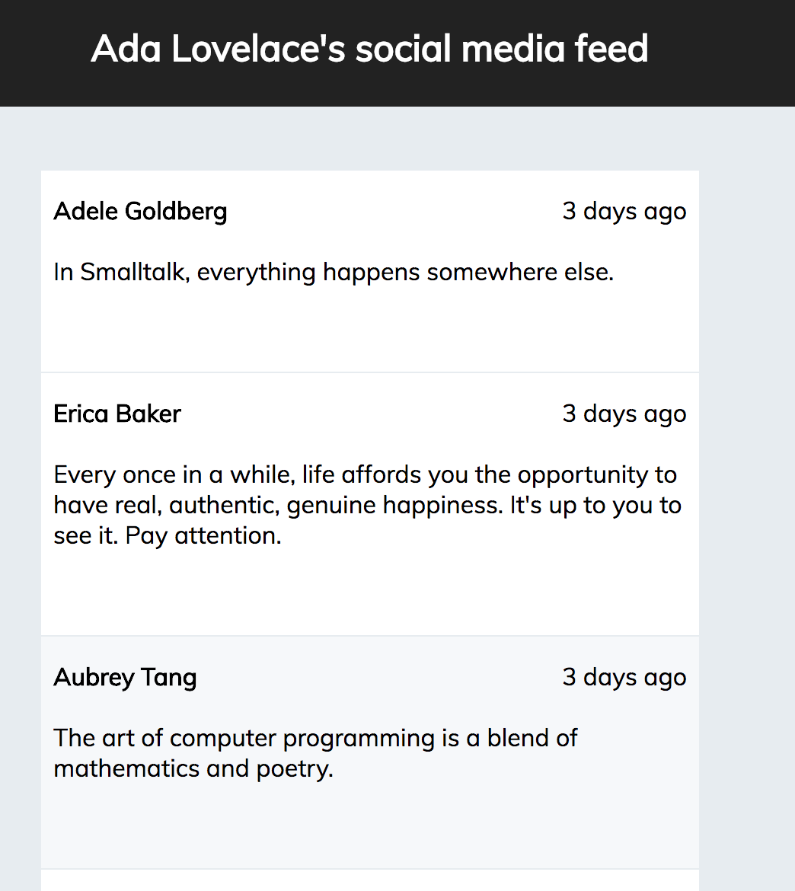

# Ada's Social Feed

In this project you will read information from a JSON file and display it as a social media timeline similar to a Facebook or Twitter feed.

## Learning Goals
In this project you will learn to:
- Build React components which recieve data through props
- Build React container components which pass information to their subcomponents

## Project Outline

We have provided you an initial Application Skeleton generated with `create-react-app`.  In the `src/data` folder you will have a JSON file filled with timeline data for a specific user.  The application will have the following components:

- `TimelineEvent` - This component will take an individual timeline event data and render it.  Each `TimelineEvent` will contain a person who posted the event, a status message and a timestamp.  You will need to use the `Timestamp` component inside this component.
- `Timeline` - This component will take a list of timeline events as a prop and render a list of `TimelineEvent` components.
- `App` - This component is the traditional outer component of the React App. The App component will read in the data from the JSON file and pass the timeline events to the `Timeline` component which it will contain.

Implement the `render` functions of each component.  An effective strategy could be to implement each component individually testing their output on the screen with hard-coded prop data before trying to integrate the entire app.

## Setup
After forking and cloning this repo you must run `npm install` in the project directory. This will download and install all of the necessary NPM modules required by the project. After that finishes successfully you can run `npm start` to begin the local development server.

## Wave 1

For wave 1 implement the `render` function of `TimelineEvent`.  It should take 3 props.
  - `person` - the person making the post.
  - `status` - the message being posted.
  - `timestamp` - the date-time of the event.

Test the component by rendering it with hardcoded data inside the `App` component.  `TimelineEvent` should use the `Timestamp` component to render the time & date of the event.

## Wave 2

For wave 2, you will implement the `render` function of the `Timeline` component.  The `Timeline` component will take one prop, `events`, an array of JavaScript objects.  The `render` function will use the array to render a set of `TimelineEvent` components.

Then read in the `/src/data/timeline.json` file into an array of objects in `/src/App.js`.  In the `render` function of the `App` component, render a `TimeLine` component using the array of objects as the `events` prop.

## Sample Solution

Below is a sample solution:

## Going Further

Add some styling to the application to make it look more like a social media feed.

## What We Are Looking For

You can check [here](./feedback.md) for things the instructors will be looking for.
